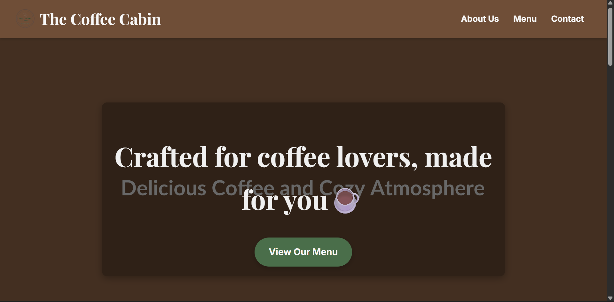
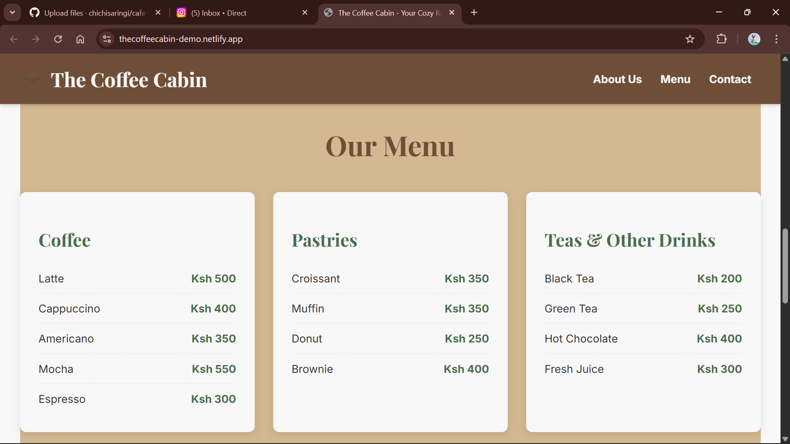
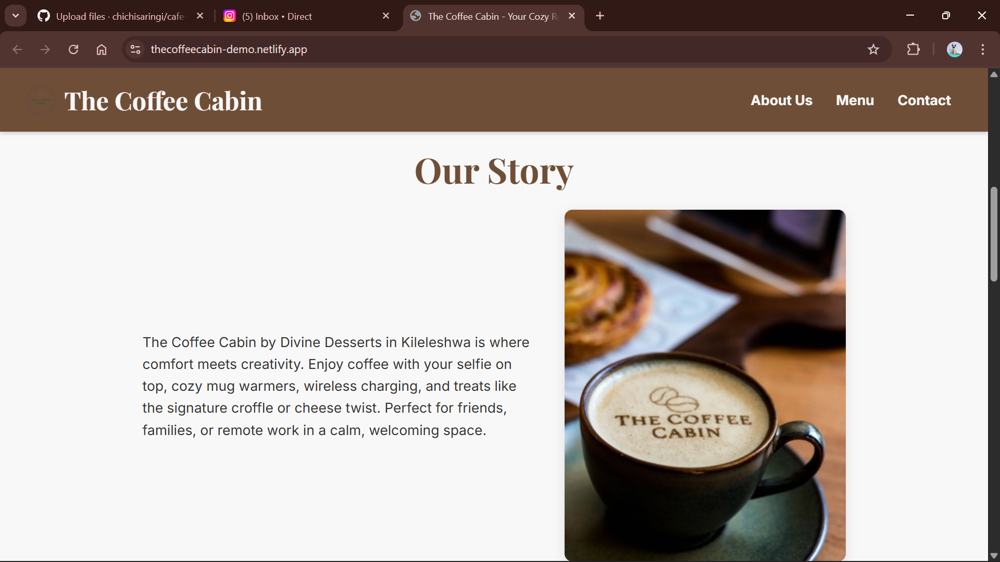
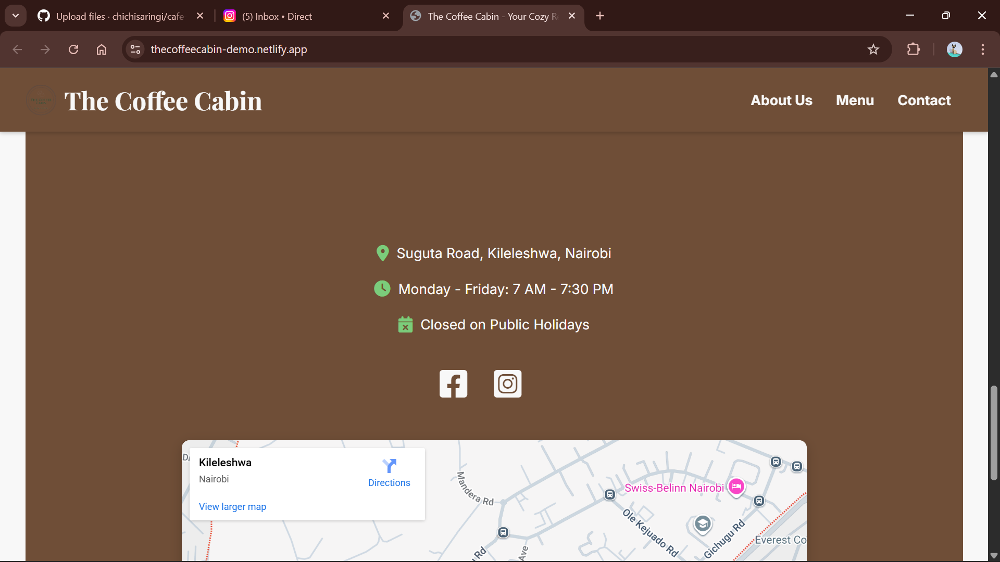

# ☕ Café Static Website

This is a simple **static website for a café**, built with **HTML and CSS**.  
It showcases the café’s menu, about section, and contact details.  
The project is designed to be clean, responsive, and beginner-friendly.

## 🚀 Demo
You can view the demo here: [Demo Link](#)  
https://thecoffeecabin-demo.netlify.app/

## 📸 Screenshots
Here are some previews of the site:

1. 
2. 
3. 
4. 

## 🛠️ Built With
- HTML5
- CSS3  


## 💡 Features
- Responsive design
- Café branding
- Simple navigation bar
- Contact form section  

## 📌 How to Use
1. Clone this repository:
   ```bash
   git clone https://github.com/chichisaringi/cafe-staticwebsite.git

  Open index.html in your browser.

✨ Future Improvements

Add JavaScript for interactivity

Online ordering system

Dark mode theme
